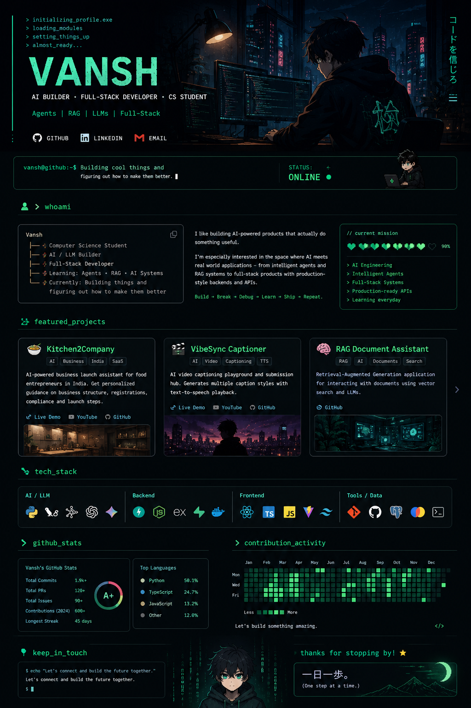

<p align="center">
  
</p>

<div align="center">

# VANSH

### `AI BUILDER` · `FULL-STACK DEVELOPER` · `CS STUDENT`


<br>

[](https://github.com/vansh-gautam-bit)
[](https://www.linkedin.com/in/vansh-gautam-ouroboros/)
[](mailto:vansh.pku@gmail.com)

</div>

---

## `> whoami`

```text
Vansh
├── 🎓 Computer Science Student
├── 🤖 AI / LLM Builder
├── ⚡ Full-Stack Developer
├── 🧠 Learning: Agents • RAG • AI Systems
└── 🚀 Currently: Building things and figuring out how to make them better
```

I like building **AI-powered products that actually do something useful.**

I'm especially interested in the space where **AI meets real-world applications** —
from intelligent agents and RAG systems to full-stack products with production-style
backends and APIs.

> **Build → Break → Debug → Learn → Ship → Repeat.**

---

## `// current mission`

```text
╔════════════════════════════════════════════════════╗
║                                                    ║
║   [███████████████████████████████████░░░]  BUILD  ║
║                                                    ║
║   → AI Engineering                                 ║
║   → Intelligent Agents                             ║
║   → Full-Stack Systems                             ║
║   → Production-ready APIs                          ║
║   → Learning something new every day               ║
║                                                    ║
╚════════════════════════════════════════════════════╝
```

---

# ⚔️ Projects

### 🥘 Kitchen2Company

**AI-powered business launch assistant for food entrepreneurs in India.**

Helps aspiring entrepreneurs understand business structures, registrations,
compliance requirements and launch steps through a personalized AI consultation.

**Built with:**

`React` `TypeScript` `Supabase` `Edge Functions` `DeepSeek` `AI/ML API` `Bright Data` `native.builder`

🔗 **Live:** https://alqqx4l4klbbm9eacngnbyxpf.nativelyai.app  
🎥 **Demo:** https://youtu.be/dQrmNiAweWk  
💻 **Repository:** https://github.com/vansh-gautam-bit/kitchen2company

---

### 🎬 VibeSync Captioner

**AI video captioning playground and submission hub.**

A full-stack application that generates multiple styles of video captions
and supports text-to-speech playback.

**Built with:**

`React` `TypeScript` `Vite` `Node.js` `Express` `Docker` `Google GenAI`

💻 **Repository:** https://github.com/vansh-gautam-bit/vibesync-captioner

---

### 📚 RAG Document Assistant

**Retrieval-Augmented Generation application for interacting with documents.**

Uses document chunking, embeddings and vector search to retrieve relevant
information before generating responses.

**Built with:**

`Python` `LangChain` `ChromaDB` `Gemini Embeddings` `RAG`

---

# 🧠 Tech Stack

### AI / LLM

<p align="left">


</p>

### Backend

<p align="left">


</p>

### Frontend

<p align="left">


</p>

### Database / Tools

<p align="left">


</p>

---

# 🐍 Contribution.exe

<div align="center">


</div>

---

# 🎯 Things I'm Exploring

```text
01  →  AI Agents
02  →  RAG & Retrieval Systems
03  →  LLM Application Architecture
04  →  Backend Engineering
05  →  Full-Stack AI Products
06  →  Machine Learning
07  →  Finance + Technology
```

---

# 📡 Connect

<div align="center">

If you're building something interesting around **AI, agents, backend systems,
or just want to talk tech — say hi.**

<br>

[](https://github.com/vansh-gautam-bit)
[](https://www.linkedin.com/in/vansh-gautam-ouroboros/)
[](mailto:vansh.pku@gmail.com)

<br><br>

```text
╭────────────────────────────────────────────╮
│                                            │
│    "The best way to learn is to build."    │   
│                                            │
╰────────────────────────────────────────────╯
```

</div>
